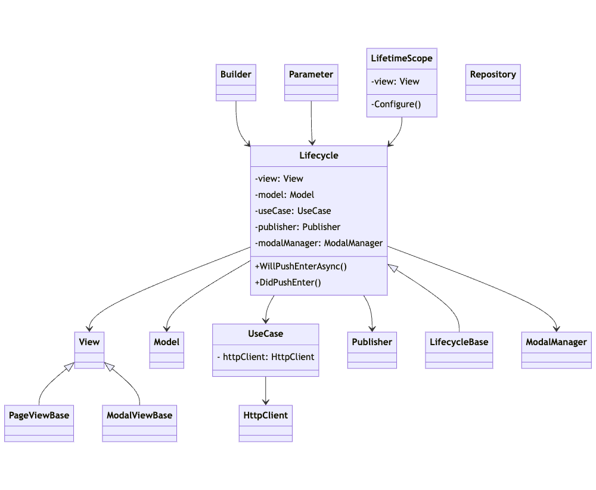

# 클래스 설계

* MVP를 기반으로 통신, 화면 전환 등 공통적인 처리나 비대화되기 쉬운 처리는 적시에 다른 클래스에서 처리합니다.&#x20;
* Model의 수명은 해당 화면 내에서만 지속되며, 영속적인 데이터는 Repository에 보관합니다.
* Presenter는 각 화면마다 1개 입니다.
* 화면 내 요소가 많아지면 Presenter도 비대해지는 경향이 있는데, 큰 처리는 별도의 클래스로 분리하여 Presenter가 직접 수행하는 처리를 줄입니다.
* Model과 View도 기본 1 화면에 하나이지만, 화면이 비대해졌거나 화면 내 요소가 독립적인 경우 분할합니다.

<figure><figcaption>
ScreenSystem Architecture
</figcaption></figure>

* UseCase, Repository와 같은 이름은 클린 아키텍처 등 다른 아키텍처에서 사용되는 용어를 채택하고 있지만, 클린 아키텍처와 일치하는 사용법은 아닙니다.
* 클린 아키텍처와 다른 아키텍처를 참고하되, 사용 편의성과 복잡성을 줄이는 것을 목표로 설계되었습니다.
