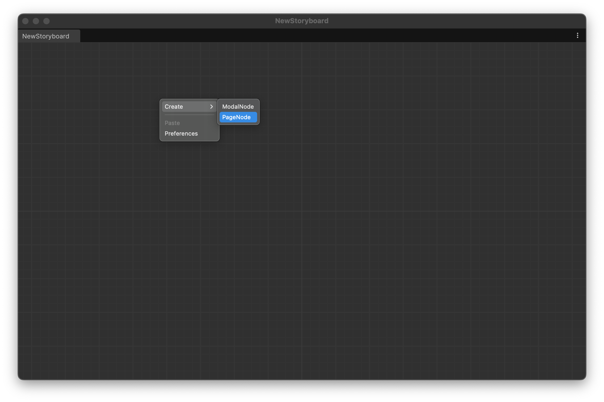
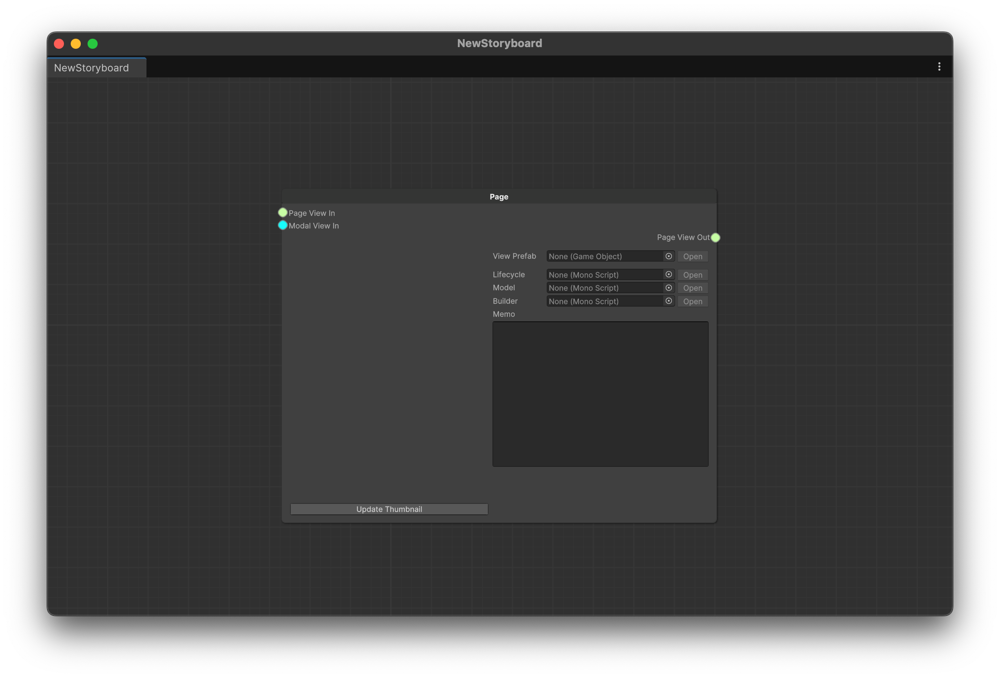
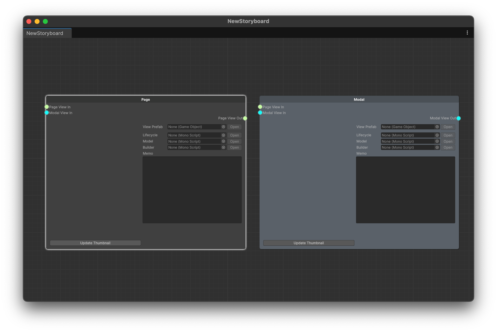

# Page 노드와 Modal 노드 추가하기

## Page 노드 생성하기

1. 스토리보드의 빈 공간에 `우클릭` -> `Create` -> `PageNode`

<figure><figcaption>
Creating PageNode
</figcaption></figure>

<figure><figcaption>
Empty PageNode
</figcaption></figure>

## Modal 노드 생성하기

모달 노드도 같은 방식으로 생성할 수 있습니다.

<figure><figcaption>
Page and Modal Node
</figcaption></figure>
