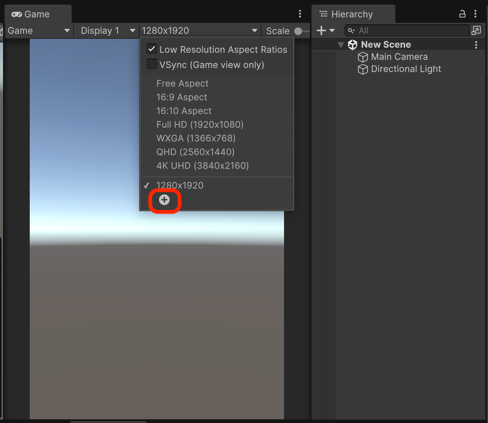
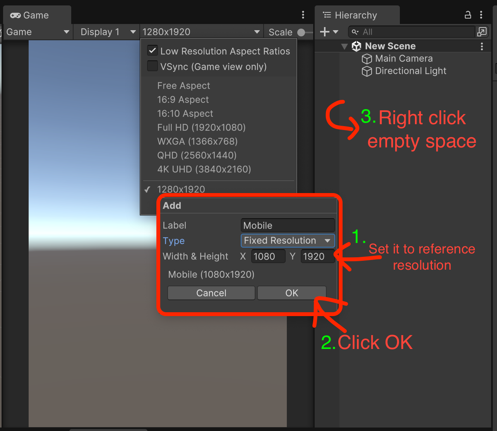
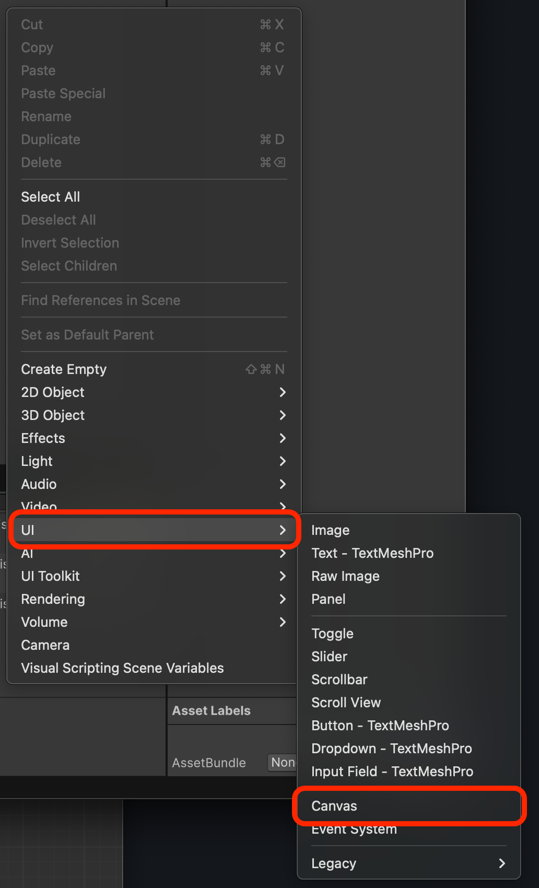
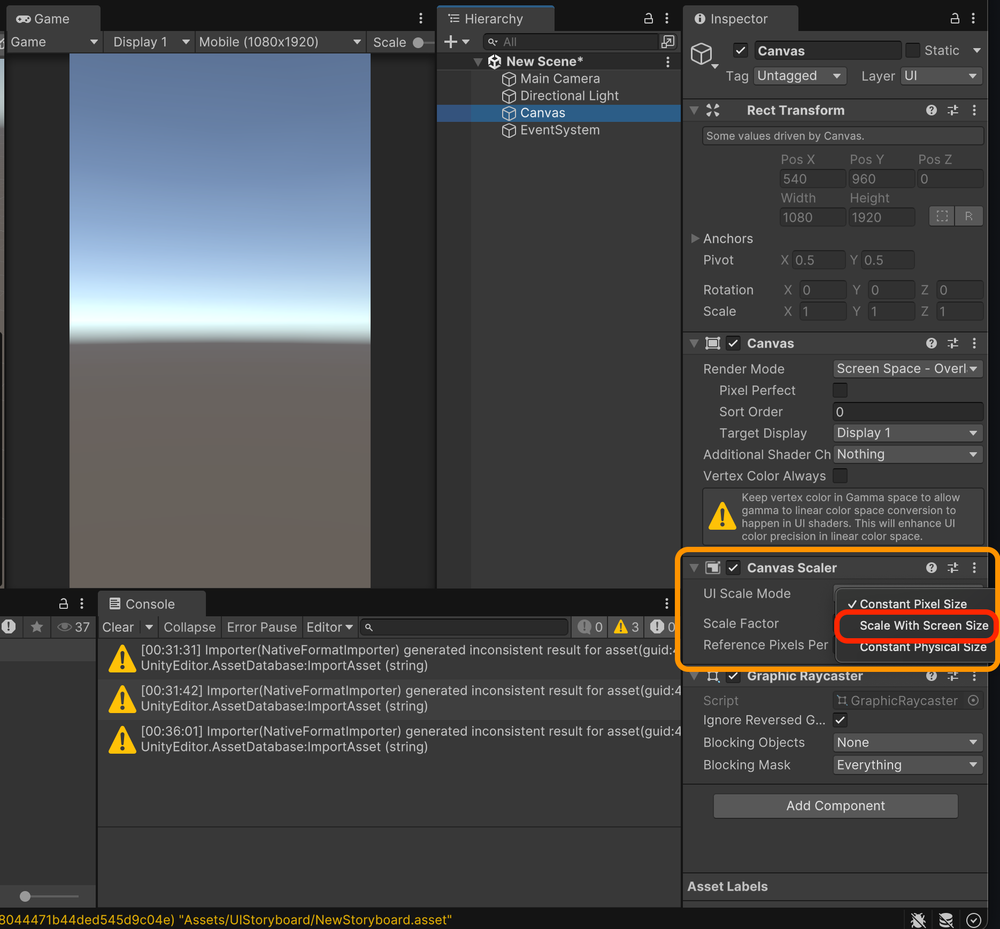
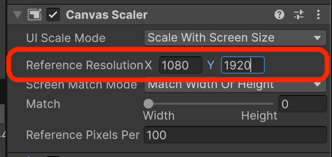
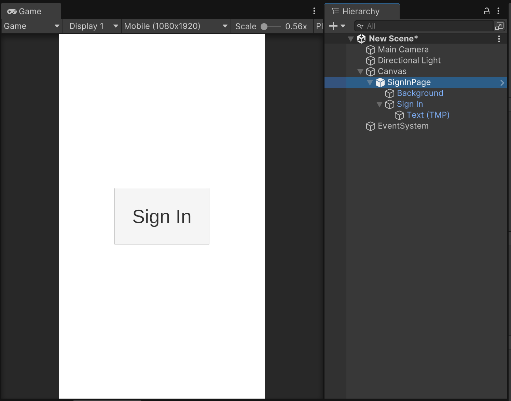

# 간단한 목업 UI 구성하기

## 빈 씬 생성하기

1. 프로젝트 윈도우에서 우클릭 -> `Create` -> `Scene` -> `Scene`
2. 생성된 씬을 더블클릭해서 열기

## 레퍼런스 해상도로 설정하기

### 에디터의 플레이어를 레퍼런스 해상도로 설정하기

<figure><figcaption></figcaption></figure>

<figure><figcaption></figcaption></figure>

### 캔버스 해상도를 레퍼런스 해상도로 설정하기

<figure><figcaption></figcaption></figure>

<figure><figcaption></figcaption></figure>

<figure><figcaption></figcaption></figure>

## 목업 UI 구성하기

본 라이브러리는 UI를 UGUI로 구성하는것을 가정으로 개발되어있습니다.

* 아래의 샘플은 Image 컴포넌트를 이용해 배경을 만들고
* Button TextMeshPro 오브젝트를 생성해 로그인 버튼을 표현했습니다.

<figure><figcaption></figcaption></figure>
