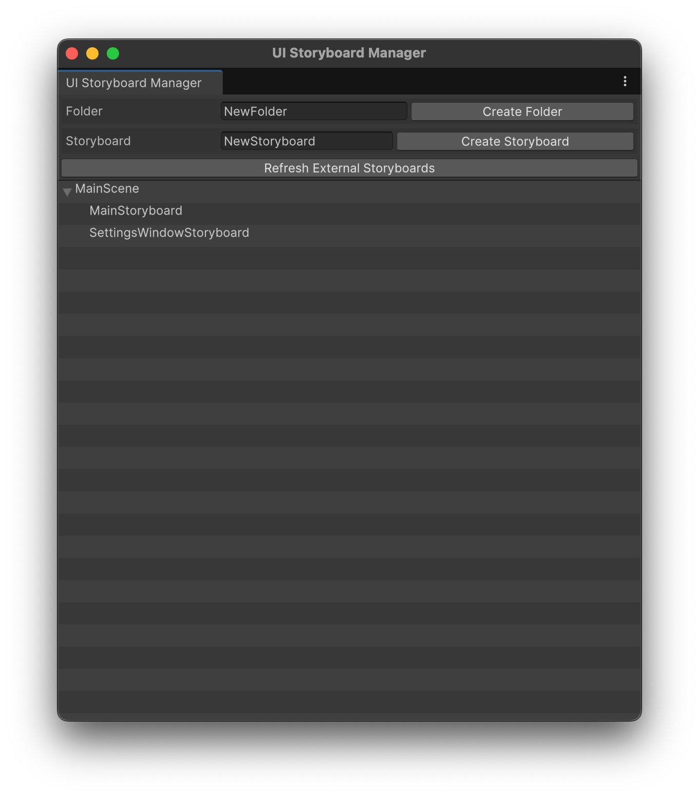
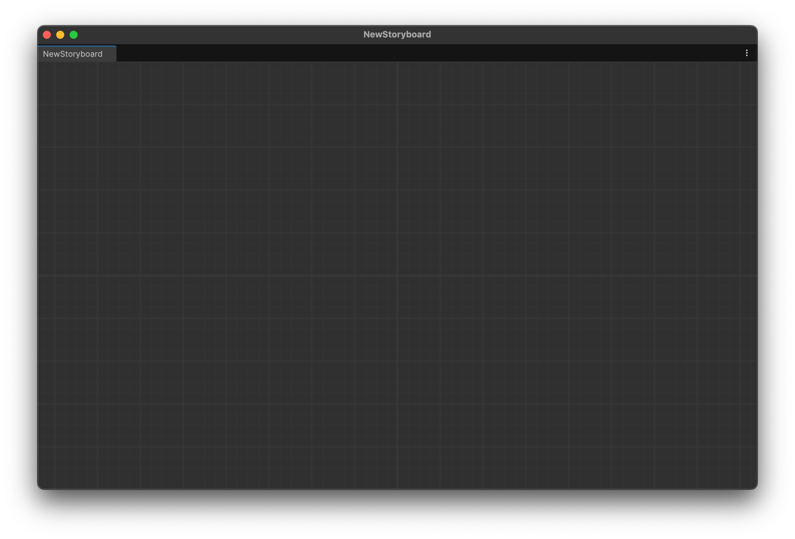

# 스토리보드 생성하기

## UI Storyboard Manager 이용하기

### 스토리보드 열기

`Window` -> `UI Storyboard` -> `Storyboard Manager` 클릭

<figure><figcaption>
Storyboard Manager
</figcaption></figure>

1. `Create Storyboard` 를 클릭해서 새로운 스토리 보드 생성
2. 아래에 스토리보드가 생성됩니다.
   1. 생성하기 전 이름을 입력해 생성할 수 있습니다.
   2. 생성 후에는 스토리보드를 우클릭 후 `rename` 버튼을 눌러 이름을 바꿀 수 있습니다.
3. 폴더를 생성할 수 있습니다.
4. 생성된 폴더에 스토리보드를 드래그 앤 드롭해서 폴더 안에 정리해 둘 수 있습니다.
5. 생성된 스토리보드를 더블클릭 해서 열 수 있습니다.

<figure><figcaption>
Empty Storyboard
</figcaption></figure>

빈 스토리보드가 열렸습니다.
