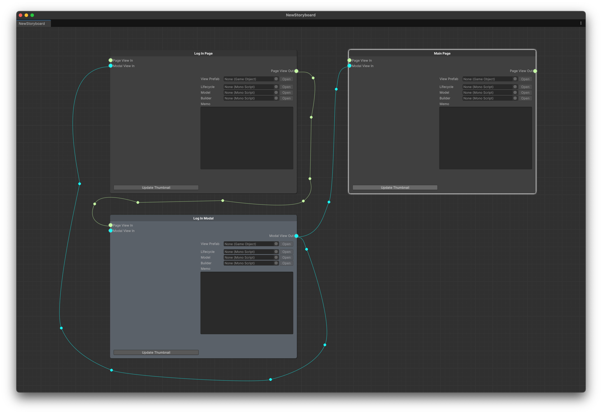

# 화면 이동을 표현하기

## 화면 이동을 표시하는 방법

* 노드와 노드를 이어서 화면 이동을 표시할 수 있습니다.
* 기획자가 화면 이동을 표시해 두면 UI/UX 디자이너가 기획 의도를 파악하기 쉬워지고 개발자가 별도로 문서화등을 통해 화면 이동을 과정을 정리 할 필요가 없어지며 실수의 여지가 줄어듭니다.

## 기획 예시

매우 간단한 기획을 예시로 진행해 봅시다.

우리는 앱의 가장 첫 화면인 로그인 화면을 기획하고 스토리보드에 이를 표현하고 싶습니다.

* 첫 로그인 `Page` 에서는 '로그인 하기' 라는 버튼이 있습니다.
* '로그인 하기' 버튼을 누르면 아이디와 패스워드를 입력할 수 있는 팝업 `Modal` 이 표시됩니다.
* 이 모달 창에는 로그인 버튼이 존재하는데, 아이디와 패스워드를 입력하고 이 버튼을 누르면 로그인이 진행됩니다.
* 로그인에 성공하면 앱의 메인 화면으로 이동하게 됩니다.

위의 기획을 바탕으로 스토리보드를 구성해 봅시다.

## 예시 스토리보드


노드의 이름변경은 노드를 우클릭 -> Rename 을 클릭해서 할 수 있습니다.

> Page와 Modal의 이름은 구분을 쉽게 하기 위해 **반드시 Page와 Modal을 뒤에 붙여서 명명**합시다.
>
> _예: Item Shop Page, Alert Modal...._


<figure><figcaption>
Example Storyboard
</figcaption></figure>

* 세 개의 UI 요소로 구성되어 있습니다.
  * **Log In Page:** 로그인 버튼이 존재하는 최초 화면입니다.
  * **Log In Modal:** 실제 로그인을 진행하는 팝업 창입니다.
  * **Main Page:** 로그인에 성공하면 진입할 수 있는 메인 화면입니다.
* Log In Page에서는 오직 Log In Modal로 이어지는 간선밖에 존재하지 않습니다.
  * Log In Page에서는 Log In Modal창을 띄우는 것만 가능합니다.
* &#x20;Log In Modal에서는 두 가지 갈림길이 존재합니다.
  * Log In Page 로 돌아오기: 모달 창을 닫았을 때
  * Main Page 로 이동하기: 로그인에 성공했을 때
