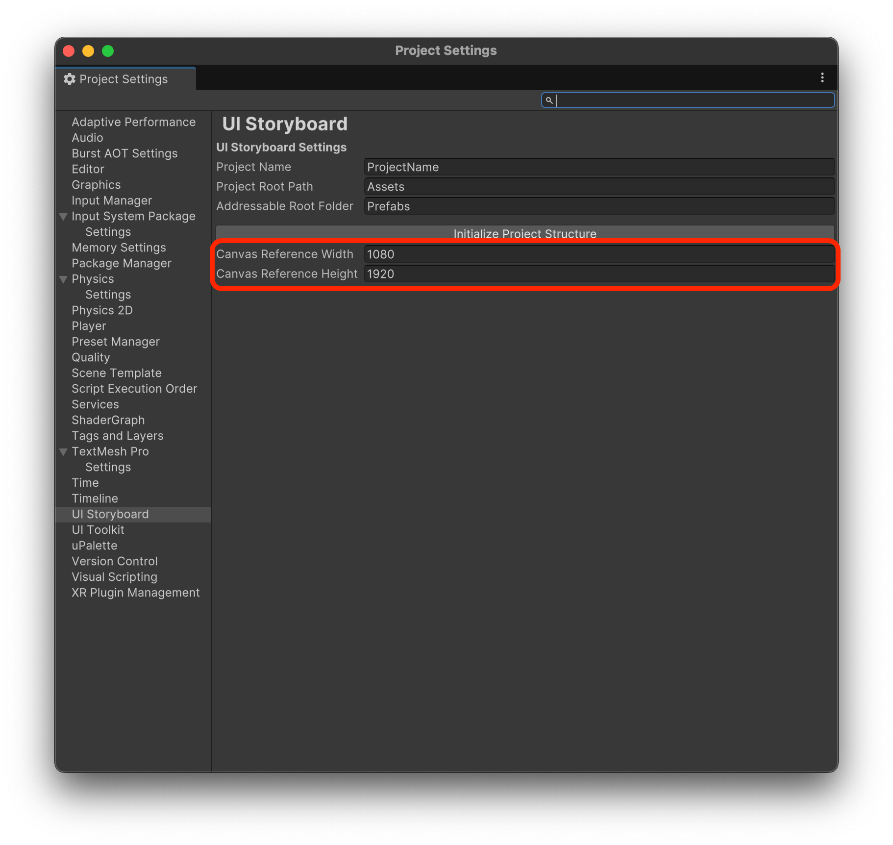

# 레퍼런스 해상도 결정하기

## 가로? 세로?

* 먼저 가로 해상도를 기준으로 할지 세로 해상도를 기준으로 할지 결정하세요.
* 웹 프론트개발과는 다르게 일반적으로 유니티와 같은 게임 앱은 가로 또는 세로 해상도 하나를 선택하여 개발하게 되고 완전한 반응형 디자인은 기본적으로 고려하지 않습니다.&#x20;
* 한손 게임을 지향하는 캐주얼 게임의 경우 세로형, 조금더 진지한 게임을 기획한다면 가로형을 택하세요.

## 고해상도? 저해상도?

* FHD, QHD, UHD... 모니터 해상도는 점점 높아지고 있다.
* 그렇다면 미래를 생각해서 고해상도로 레퍼런스를 잡는게 좋을까? -> 아니다.
* UI는 고해상도일 필요가 없다.
  * UI 리소스는 **성능에 매우매우 큰 영향**을 미친다.
  * 동시에 리소스가 고해상도라고 해서 사용자가 크게 체감하지는 못한다.
* 보통의 모바일 지향이라면 FHD 이하의 해상도면 충분하다.
* 예를들어 한 유니티 인기 UI 에셋은 978x1664 해상도 기준으로 제작되어있다.

***

이 예시 가이드에서는 1080x1920을 기준으로 해 보자.

## 설정에서 레퍼런스 해상도를 등록

<figure><figcaption></figcaption></figure>

* 여기서 등록한 레퍼런스 해상도는 스토리보드에서 Page 와 Modal 프리펩의 썸네일을 자동 생성될 때 기준으로 사용된다.
* 추후 실제 게임에서 동작할 Canvas에서도 위의 해상도와 동일하게 세팅 해 놓고 사용한다.
