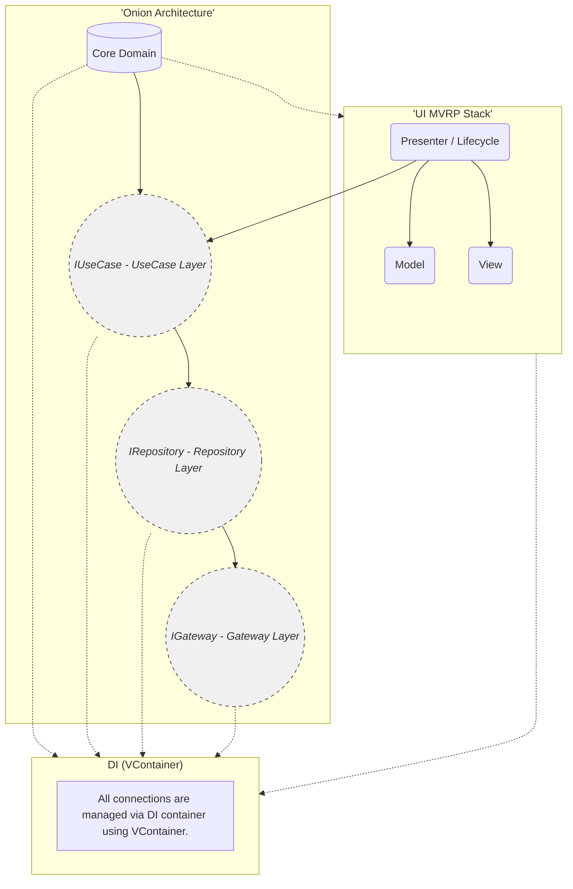

# 전체 구조 도표

```mermaid
flowchart TB
    %% Onion Architecture Subgraph
    subgraph 'Onion Architecture'
      direction TB
      CoreDomain[(Core Domain)]
      UseCases((IUseCase - UseCase Layer))
      Repository((IRepository - Repository Layer))
      Gateway((IGateway - Gateway Layer))
    end

    %% UI Subgraph
    subgraph UI_MVRP_Stack['UI MVRP Stack']
      direction TB
      Presenter(Presenter / Lifecycle)
      Model(Model)
      View(View)
    end

    %% Core Domain is the base for the entire architecture, including UI
    CoreDomain -.-> UI_MVRP_Stack

    %% Connections between layers
    CoreDomain --> UseCases
    UseCases --> Repository
    Repository --> Gateway
    
    Presenter --> UseCases
    Presenter --> Model
    Presenter --> View

    %% Notes and Dependency Injection
    classDef interface fill:#f0f0f0,stroke:#333,stroke-width:1px,stroke-dasharray: 5 5,color:#333,font-style:italic;

    %% Apply interface style
    class UseCases,Repository,Gateway interface

    %% Dependency Injection Explanation
    subgraph DependencyInjection["DI (VContainer)"]
      note1[All connections are managed via DI container using VContainer.]
    end
    CoreDomain -.-> DependencyInjection
    UseCases -.-> DependencyInjection
    Repository -.-> DependencyInjection
    Gateway -.-> DependencyInjection
    UI_MVRP_Stack -.-> DependencyInjection
```

