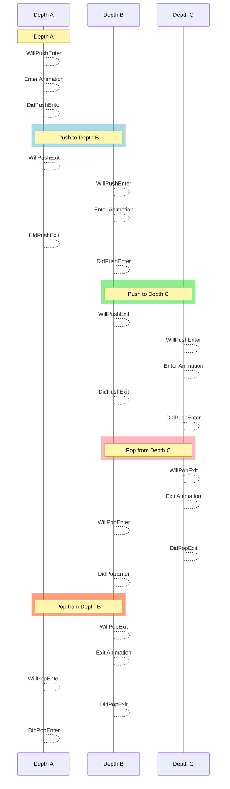

# Lifecycle

```mermaid
sequenceDiagram
    participant A as Depth A
    participant B as Depth B
    participant C as Depth C

    %% Depth A: 첫 Push
    Note over A: Depth A
    A-->A: WillPushEnter
    A-->A: Enter Animation
    A-->A: DidPushEnter

    %% Push to Depth B
    rect rgb(173, 216, 230)
    Note over A,B: Push to Depth B
    end
    A-->A: WillPushExit
    B-->B: WillPushEnter
    B-->B: Enter Animation
    A-->A: DidPushExit
    B-->B: DidPushEnter

    %% Push to Depth C
    rect rgb(144, 238, 144)
    Note over B,C: Push to Depth C
    end
    B-->B: WillPushExit
    C-->C: WillPushEnter
    C-->C: Enter Animation
    B-->B: DidPushExit
    C-->C: DidPushEnter

    %% Pop from Depth C
    rect rgb(255, 182, 193)
    Note over C,B: Pop from Depth C
    end
    C-->C: WillPopExit
    C-->C: Exit Animation
    B-->B: WillPopEnter
    C-->C: DidPopExit
    B-->B: DidPopEnter

    %% Pop from Depth B
    rect rgb(255, 160, 122)
    Note over B,A: Pop from Depth B
    end
    B-->B: WillPopExit
    B-->B: Exit Animation
    A-->A: WillPopEnter
    B-->B: DidPopExit
    A-->A: DidPopEnter
```

